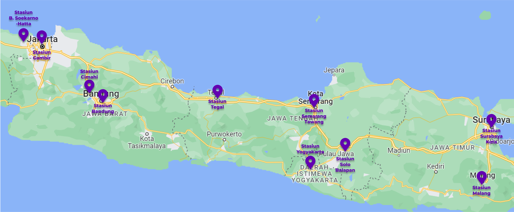

# Howdii Friends👋

## 🔥Steps : 

👠Clone this repo to your Local Directory ( git clone https://github.com/dxkrnn/tiket_kereta.git )  
👠Open Directory as Project on your IDE (like IntelliJ, VsCode, etc) 
👠Run main method on Main class (src/com/tiket_kereta/**Main.java**) 
👠Test the program 
👠Report the issues 

***For Testing :***  
Admin username  : *admin*  
Admin passwd    : *admin123*  

**!You can also register usernames for other users**

Hv a nc dy! Thanks🤗

  
***👇 Below are images of Train Station Maps and Graph implementation***

